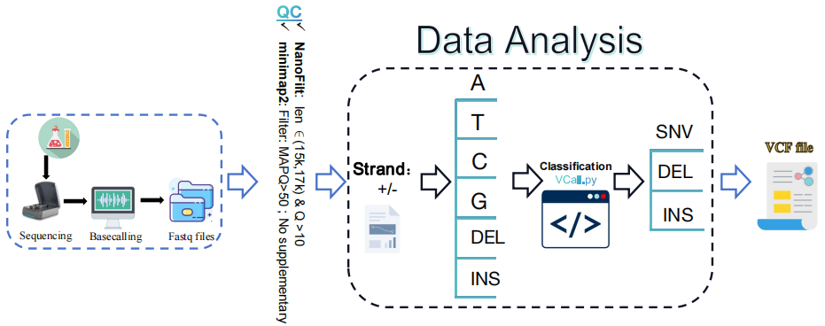

# <font size=6 color='gray'> VCall is a varints caller based on TGS or NGS sequencing data for small genomes</font>
***<font size=5 color='blue'>Highlight</font>***
- **VCall is an updated version of the CmVCall https://github.com/willow2333/CmVCall**
- **If you have the sequencing fastq files of different Sequencing platforms, you can fetch the variant sites '*.vcf' file by VCall Tool.**
- **If you have the amplicons seuencing data of a circular genomes, you just need to input the position  of primer by '--spot1' parameter.**
- **The VCall also output the genome consensus fasta.**

***<font size=5 color='blue'>VCall workflow</font>***
 
* **Install**
Creating the conda env of VCall and installing packages. 
```shell
conda create -n VCall python==3.10.13 minimap2 samtools seqkit pysam nanofilt scipy Levenshtein tqdm
conda activate VCall
```
* **Download**
```shell
git clone https://github.com/willow2333/VCall.git
```

* **Usage**
```shell
usage: vcall.py [-h] [--inputdir INPUTDIR] [--ref REF] [--homodir HOMODIR] [--refname REFNAME] [--refid REFID] [--min MIN] [--max MAX] [--n N] [--q Q] [--Q Q] [--spot1 SPOT1] [--spot2 SPOT2] [--depth DEPTH]
                [--a1 A1] [--a2 A2] [--FC FC] [--nbase NBASE] [--delr DELR] [--bg BG]

options:
  -h, --help           show this help message and exit

General options:
  --inputdir INPUTDIR  The path of sequencing data, fastq or fasta.
  --ref REF            The absolute path of reference.
  --homodir HOMODIR    Output file of reference homopolymer.
  --refname REFNAME    The name of reference file.
  --refid REFID        The id of reference sequence.

Reads QC options:
  --min MIN            Filter at a minimum read length. [default:0]
  --max MAX            Filter at a maximum read length. [default:1000000]
  --n N                The downsampling numbers of the raw reads. [default:6000]
  --q Q                The cutoff of q-value, the reads with q-value less than the cutoff will be removed. [default:10]

Alignment options:
  --Q Q                Reads mapping quality >= INT. [default:60]
  --spot1 SPOT1        The primer start position of circle reference, if line sequence the value need to be set 1.
  --spot2 SPOT2        The end position of reference sequence.

Varints calling options:
  --depth DEPTH        The lowest depth of reads. [default:100]
  --a1 A1              First allele frequency. [default:0.75]
  --a2 A2              Second allele frequency. [default:0.1]
  --FC FC              The fold change value between a1 and a2. [default:25]
  --nbase NBASE        The k-mer value, it will be use to generate the motifs of reads. [default:3]
  --delr DELR          The frequency of deletion. [default:0.7]
  --bg BG              The background nosie of the sequencing platform. [default:.0.1]
```
* **Test**
Human mitochondrial genome data was uesed for testing.
```shell
cd VCall
python vcall.py --inputdir test --ref reference/NC_012920.1.fasta --homodir reference --refname NC_012920.1.fasta --refid NC_012920.1
````
* **Result file**
```shell
##fileformat=VCF
##fileDate=2024-11-01_11:26:11
##source=VCall v1.0
##reference=reference/NC_012920.1.fasta
##species="Homo sapiens",taxonomy=x>
##INFO=<ID=DP,Number=1,Type=Integer,Description="Total Depth">
##INFO=<ID=AF,Number=A,Type=Float,Description="Allele Frequency">
##INFO=<ID=TYPE, TYPE=INS/DEL/SNV , DEL and INS represent this postion is deletion or insertion, and +N means N insertion between this postion and the next position>
#CHROM POS ID  REF   ALT    QUAL   FILTER    INFO   FORMAT
NC_012920.1	2627	.	G	G,A	.	PASS	DP=1838;AF=0.829,0.088;TYPE=SNV
NC_012920.1	2705	.	T	T,C	.	PASS	DP=1838;AF=0.841,0.108;TYPE=SNV
NC_012920.1	2706	.	A	G	.	PASS	DP=1838;AF=0.772;TYPE=SNV
NC_012920.1	2826	.	G	G,A	.	PASS	DP=1839;AF=0.899,0.056;TYPE=SNV
NC_012920.1	2834	.	C	C,T	.	PASS	DP=1839;AF=0.919,0.055;TYPE=SNV
NC_012920.1	3107	.	N	*	.	PASS	DP=1839;AF=0.884;TYPE=DEL
NC_012920.1	3156	.	A	A,G	.	PASS	DP=1839;AF=0.933,0.052;TYPE=SNV
NC_012920.1	3425	.	T	T,C	.	PASS	DP=1839;AF=0.826,0.108;TYPE=SNV
NC_012920.1	3700	.	G	G,A	.	PASS	DP=1839;AF=0.890,0.081;TYPE=SNV
NC_012920.1	3707	.	G	G,A	.	PASS	DP=1839;AF=0.861,0.094;TYPE=SNV
NC_012920.1	3920	.	C	C,T	.	PASS	DP=1840;AF=0.878,0.081;TYPE=SNV
NC_012920.1	3922	.	G	G,A	.	PASS	DP=1840;AF=0.845,0.098;TYPE=SNV
NC_012920.1	3945	.	C	C,T	.	PASS	DP=1840;AF=0.820,0.105;TYPE=SNV
NC_012920.1	4142	.	G	G,A	.	PASS	DP=1840;AF=0.881,0.102;TYPE=SNV
NC_012920.1	4346	.	G	G,A	.	PASS	DP=1840;AF=0.803,0.135;TYPE=SNV
NC_012920.1	4540	.	C	C,T	.	PASS	DP=1842;AF=0.900,0.067;TYPE=SNV
NC_012920.1	4769	.	A	G	.	PASS	DP=1842;AF=0.988;TYPE=SNV
NC_012920.1	4820	.	G	A	.	PASS	DP=1842;AF=0.933;TYPE=SNV
NC_012920.1	4849	.	G	G,A	.	PASS	DP=1842;AF=0.930,0.053;TYPE=SNV
NC_012920.1	5729	.	A	A,G	.	PASS	DP=1842;AF=0.850,0.078;TYPE=SNV
NC_012920.1	5767	.	C	C,T	.	PASS	DP=1842;AF=0.924,0.050;TYPE=SNV
NC_012920.1	6023	.	G	A	.	PASS	DP=1843;AF=0.959;TYPE=SNV
NC_012920.1	6216	.	T	C	.	PASS	DP=1843;AF=0.892;TYPE=SNV
NC_012920.1	6413	.	T	C	.	PASS	DP=1843;AF=0.987;TYPE=SNV
NC_012920.1	7028	.	C	T	.	PASS	DP=1843;AF=0.936;TYPE=SNV
NC_012920.1	7121	.	C	C,T	.	PASS	DP=1843;AF=0.890,0.055;TYPE=SNV
NC_012920.1	7603	.	A	A,G	.	PASS	DP=1845;AF=0.877,0.081;TYPE=SNV
NC_012920.1	8006	.	C	C,T	.	PASS	DP=1846;AF=0.818,0.145;TYPE=SNV
NC_012920.1	8020	.	G	G,A	.	PASS	DP=1846;AF=0.934,0.053;TYPE=SNV
```
© 2024 by Liu Qin (ql_willow@163.com).
