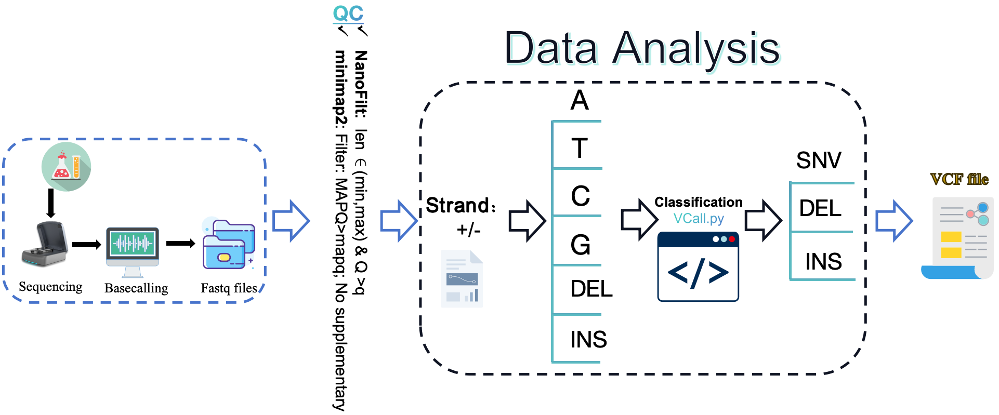

# <font size=6 color='gray'> VCall is a varints caller based on TGS or NGS sequencing data for small genomes species</font>
***<font size=5 color='blue'>Highlight</font>***
- **VCall is an updated version of the CmVCall https://github.com/willow2333/CmVCall**
- **If you have the sequencing fastq files of different Sequencing platforms, you can fetch the variant sites '*.vcf' file by VCall Tool.**
- **If you have the amplicons seuencing data of a circular genomes, you just need to input the position  of primer by '--spot1' parameter.**
- **The VCall also output the genome consensus fasta.**

***<font size=5 color='blue'>VCall workflow</font>***

* **Install**

Creating the conda env of VCall and installing packages. 
```shell
conda create -n VCall python==3.10.13 minimap2 samtools seqkit pysam nanofilt scipy Levenshtein tqdm
conda activate VCall
```
* **Download**
```shell
git clone https://github.com/willow2333/VCall.git
```

* **Usage**
```shell
usage: vcall.py [-h] [--inputdir INPUTDIR] [--ref REF] [--homodir HOMODIR] [--refname REFNAME] [--refid REFID]

options:
  -h, --help           show this help message and exit

General options:
  --inputdir INPUTDIR  The path of sequencing data, fastq or fasta.
  --ref REF            The absolute path of reference.
  --homodir HOMODIR    Output file of reference homopolymer.
  --refname REFNAME    The name of reference file.
  --refid REFID        The id of reference sequence.
```
* **Test**

Human mitochondrial genome data was uesed for testing.
```shell
cd VCall
python vcall.py --inputdir test --ref reference/NC_012920.1.fasta --homodir reference --refname NC_012920.1.fasta --refid NC_012920.1
````
* **Result file**
```shell
##fileformat=VCF
##fileDate=2024-11-04_13:31:07
##source=VCall v1.0
##reference=reference/NC_012920.1.fasta
##species="Homo sapiens",taxonomy=x>
##INFO=<ID=DP,Number=1,Type=Integer,Description="Total Depth">
##INFO=<ID=AF,Number=A,Type=Float,Description="Allele Frequency">
##INFO=<ID=TYPE, TYPE=INS/DEL/SNV , DEL and INS represent this postion is deletion or insertion, and +N means N insertion between this postion and the next position>
#CHROM POS ID  REF   ALT    QUAL   FILTER    INFO   FORMAT
NC_012920.1     2706    .       A       G       .       PASS    DP=183;AF=0.770;TYPE=SNV
NC_012920.1     3107    .       N       *       .       PASS    DP=183;AF=0.891;TYPE=DEL
NC_012920.1     4769    .       A       G       .       PASS    DP=184;AF=0.989;TYPE=SNV
NC_012920.1     4820    .       G       A       .       PASS    DP=184;AF=0.880;TYPE=SNV
NC_012920.1     6023    .       G       A       .       PASS    DP=184;AF=0.935;TYPE=SNV
NC_012920.1     6216    .       T       C       .       PASS    DP=184;AF=0.793;TYPE=SNV
NC_012920.1     6413    .       T       C       .       PASS    DP=184;AF=0.940;TYPE=SNV
NC_012920.1     7028    .       C       T       .       PASS    DP=184;AF=0.957;TYPE=SNV
NC_012920.1     8272    .       C       *       .       PASS    DP=184;AF=0.772;TYPE=DEL
NC_012920.1     8273    .       C       *       .       PASS    DP=184;AF=0.815;TYPE=DEL
NC_012920.1     8274    .       C       *       .       PASS    DP=184;AF=0.815;TYPE=DEL
NC_012920.1     8275    .       C       *       .       PASS    DP=184;AF=0.810;TYPE=DEL
NC_012920.1     8276    .       C       *       .       PASS    DP=184;AF=0.832;TYPE=DEL
NC_012920.1     8277    .       T       *       .       PASS    DP=184;AF=0.842;TYPE=DEL
NC_012920.1     8278    .       C       *       .       PASS    DP=184;AF=0.897;TYPE=DEL
NC_012920.1     8279    .       T       *       .       PASS    DP=184;AF=0.891;TYPE=DEL
NC_012920.1     8860    .       A       G       .       PASS    DP=184;AF=0.853;TYPE=SNV
NC_012920.1     11719   .       G       A       .       PASS    DP=184;AF=0.962;TYPE=SNV
NC_012920.1     13590   .       G       A       .       PASS    DP=184;AF=0.929;TYPE=SNV
NC_012920.1     14669   .       A       G       .       PASS    DP=184;AF=0.902;TYPE=SNV
NC_012920.1     14766   .       C       T       .       PASS    DP=184;AF=0.946;TYPE=SNV
NC_012920.1     15326   .       A       G       .       PASS    DP=179;AF=0.927;TYPE=SNV
NC_012920.1     15535   .       C       T       .       PASS    DP=175;AF=0.937;TYPE=SNV
NC_012920.1     16136   .       T       C       .       PASS    DP=167;AF=0.886;TYPE=SNV
NC_012920.1     16183   .       A       *       .       PASS    DP=167;AF=0.719;TYPE=DEL
NC_012920.1     16184   .       C       *       .       PASS    DP=167;AF=0.719;TYPE=DEL
NC_012920.1     16189   .       T       *       .       PASS    DP=167;AF=0.832;TYPE=DEL
NC_012920.1     16217   .       T       C       .       PASS    DP=167;AF=0.970;TYPE=SNV
```
© 2024 by Liu Qin (ql_willow@163.com)
